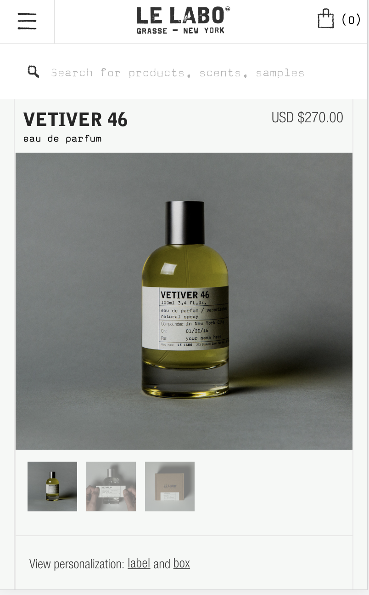
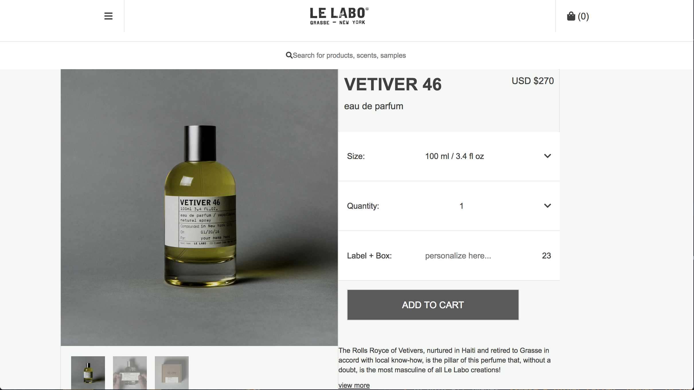
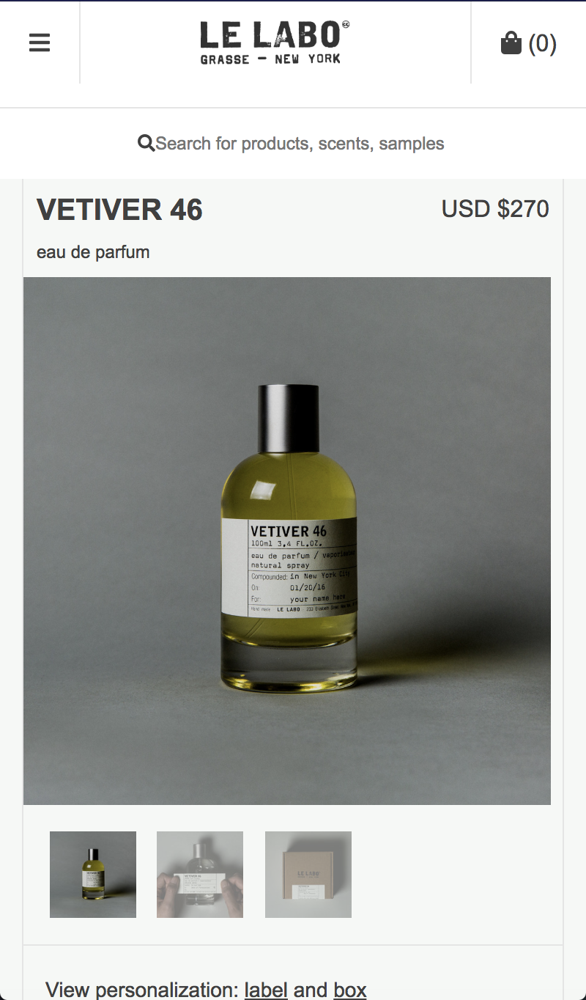

# Le Labo Clone

## By Jessica Schmitz

# Description
This is a single page website clone of Le Labo fragrances, with emphasis on design layout.

|Screenshot of this Application | Original Website Layout |
|  |  |

# My Clone Layout:
* Wide screen View

* Mobile View

# Specifications
* The program will hold the necessary files and folders for easy cloning

# Setup Requirements
* Clone this repository
* Run npm install to install all dependencies
* Run npm run start to build and start the development environment

# Notes
* If you want to rename your assets folder, currently known as 'images', **Make sure to change the outputPath and inputPath in webpack.config.js > module > rules > file-loader to your desired assets directory name.**

# Technologies
* HTML
* CSS
* CSS Grid, Flexbox
* JavaScript
* Webpack
* Jasmine
* Karma

This project uses the _MIT License_
&copy; **Jessica Schmitz** 2018
